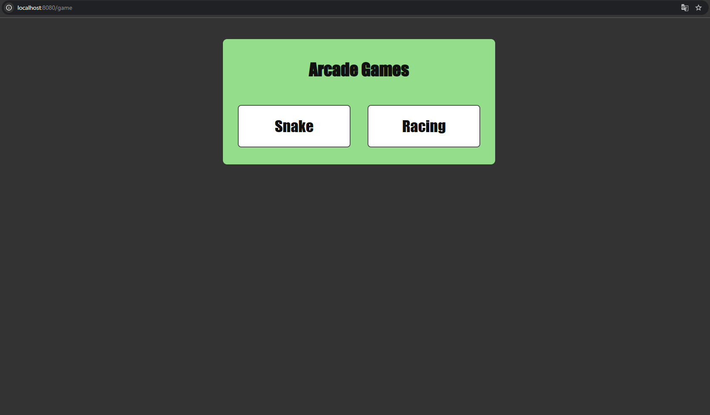
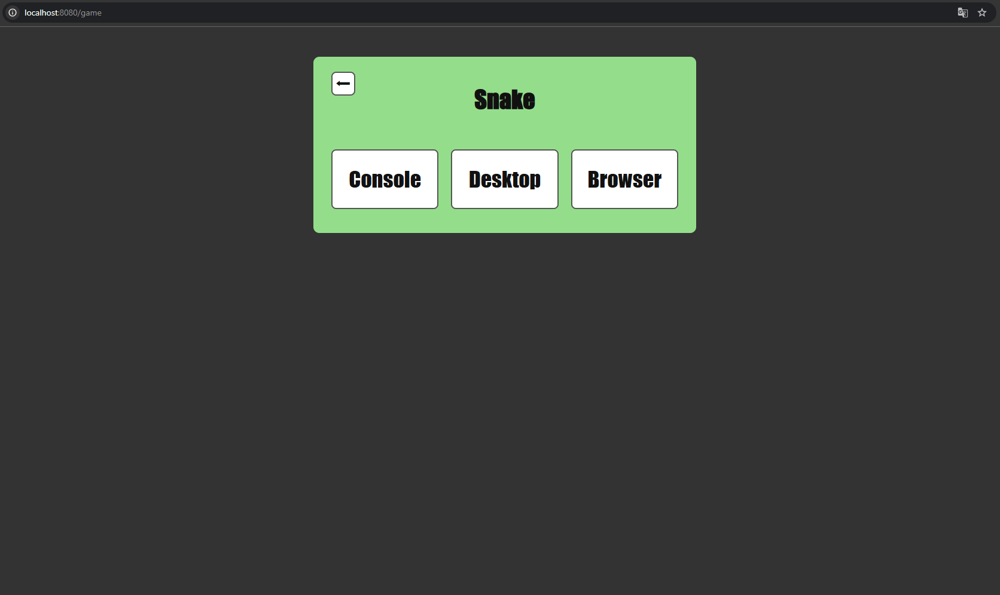
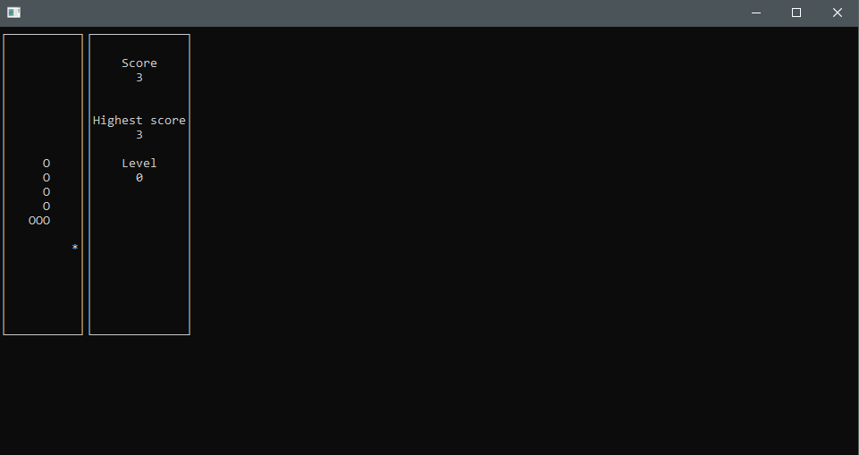
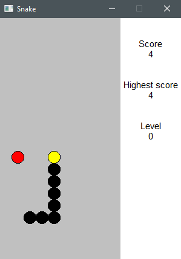
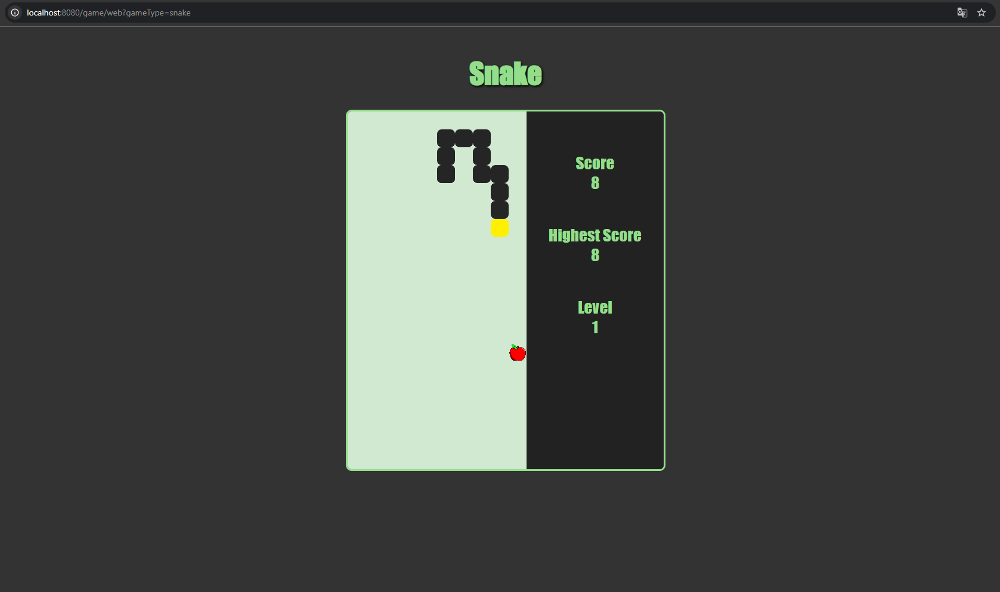
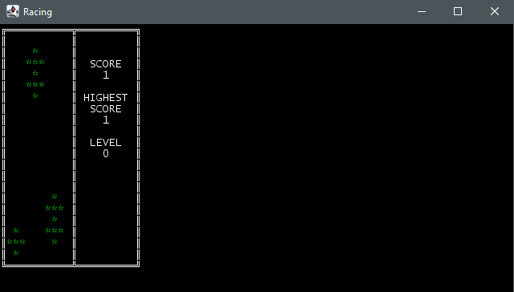
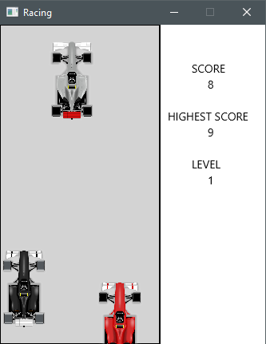
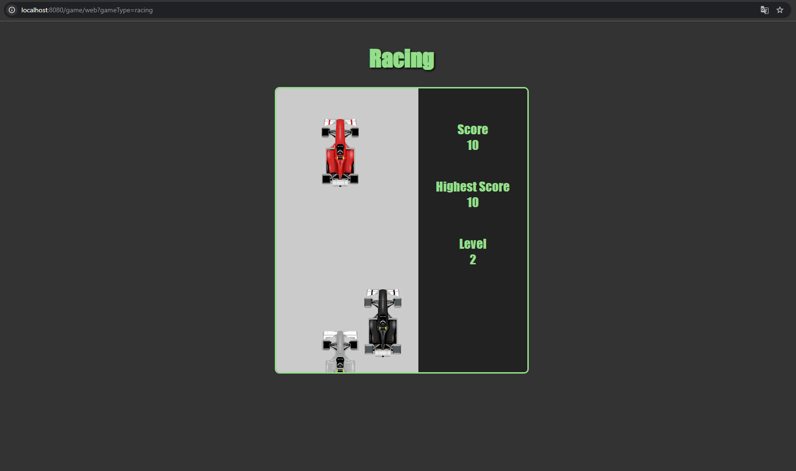

# Fullstack проект с набором игр и поддержкой разных интерфейсов

Технологии:

* Frontend: Vue 3, Vanilla JS (Canvas), HTML/CSS
* Backend:
    * Змейка: С++17, httplib, Qt 5 (GUI), pdcurses (TUI), CMake
    * Гонки: Java 18, Spring Web MVC 6.2, Spring WebFlux 6.2, Thymeleaf 3.1, Tomcat 10.1, JavaFX 22 (GUI), Lanterna
      3.1 (TUI), JUnit 5, Maven

---

## Описание

Проект, позволяющий поиграть в аркадную змейку или гонки. Игрок открывает в браузере стартовую страницу (по
умолчанию localhost:8080/game) и выбирает игру и интерфейс. Каждая игра поддерживает 3 вида интерфейса:

* консольный
* десктопный
* браузерный

Каждая игра работает на собственном сервере: змейка (httplib, порт 8081), гонки (Tomcat, порт 8080). Tomcat
является основным сервером и проксирует запросы на httplib сервер с помощью WebClient.

---

## Игровые механики

В игре присутствует подсчет очков и хранение максимального количества очков. Данная информация выводится интерфейсом в
боковой панели. Максимальное количество очков хранится в файле и сохраняется между запусками игры. Каждый обгон или
съеденное яблоко приносят одно очко. Также есть механика уровней сложности. Каждый раз, когда игрок набирает 5 очков,
уровень увеличивается на 1. Повышение уровня увеличивает скорость движения змейки или машин. Максимальное количество
уровней — 10.

---

## Игровое управление

* Змейка

<kbd>Enter</kbd> Ускорение (при повторном нажатии ускорение сбросится)

<kbd>↑</kbd> <kbd>↓</kbd> <kbd>←</kbd> <kbd>→</kbd> Смена направления змейки

<kbd>Space</kbd> Пауза/Продолжение

* Гонки

<kbd>↑</kbd> Ускорение (при повторном нажатии ускорение сбросится)

<kbd>←</kbd> <kbd>→</kbd> Смена дорожной полосы

<kbd>Space</kbd> Пауза/Продолжение

---

## Примеры интерфейса и геймплея

Выбор и запуск игры

* Страница выбора игры

* Страница выбора интерфейса

Змейка

* Консольный режим

* Десктопный режим

* Браузерный режим

Гонки

* Консольный режим

* Десктопный режим

* Браузерный режим

---

## Запуск проекта

Необходимые инструменты:

* [Java (JDK) 18+](https://github.com/corretto/corretto-18/releases)
* [Qt Framework 5.15.2+](https://www.qt.io/download-dev) с компонентами:
    - MinGW 8.1.0 64-bit (или новее)
    - Qt Core
    - Qt GUI

**Особенности проекта**

* C++ часть компилируется через CMake (exec-maven-plugin в pom.xml)
* Qt-пути указаны для Windows (замените в стр. 172-173 pom.xml при необходимости)

### С помощью командной строки

Находясь в корневой папке проекта, выполнить:

Linux/macOS:

* ./mvnw package

Windows:

* mvnw.cmd package

После успешной сборки:

* java -jar target/ArcadeGames-1.0.jar

### С помощью среды разработки (IntelliJ IDEA, Eclipse, NetBeans)

* Найдите в боковой панели закладку с Maven
* Выполните цель `package` из ArcadeGames/Lifecycle
* После успешной сборки, найдите `ArcadeGamesApp` в src/main/java/backend/server
* Нажмите ▶️ рядом с классом (или Shift+F10 в IntelliJ IDEA)